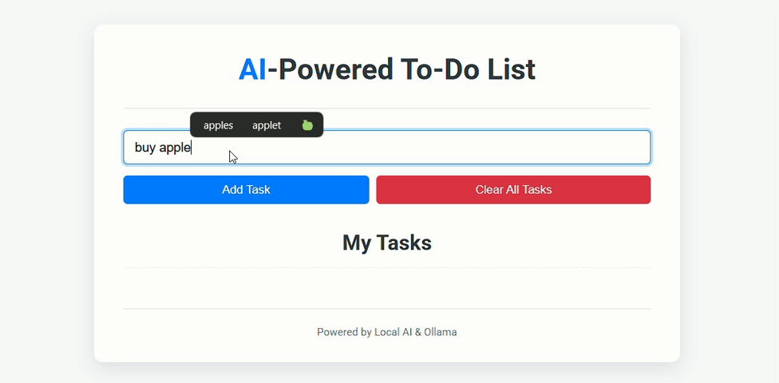

# AI-Powered To-Do List

This is a smart to-do list application powered by a local Large Language Model (LLM) run via Ollama. It can understand natural language updates to manage your tasks.

This project was developed with the assistance of an AI coding partner.

## Features

*   Add new tasks.
*   Intelligently update tasks based on natural language:
    *   Splitting a general task into specific sub-tasks.
    *   Marking parts of a task as complete while others remain pending.
    *   (Future: Marking entire tasks as done/pending directly).
*   Tasks persist in the browser's local storage.
*   "Clear All Tasks" functionality.
*   Responsive design for a good user experience on different screen sizes.

## Demo

Watch the application in action:



## Screenshots

**Main Interface after adding tasks:**


**Example of AI understanding an update (task splitting):**


## Tech Stack

*   **Frontend:** HTML5, CSS3, Vanilla JavaScript
*   **Backend:** Node.js with Express.js (for serving files and as an API proxy)
*   **LLM Orchestration:** Ollama
*   **LLM:** gemma3:4b (can be configured to other models supported by Ollama)
*   **Version Control:** Git & GitHub

## Setup & Run

1.  **Prerequisites:**
    *   Node.js (v18+ recommended) and npm installed.
    *   Ollama installed and running ([ollama.com](https://ollama.com/)).
    *   The specified LLM (e.g., `gemma3:4b`) pulled via Ollama:
        ```bash
        ollama pull gemma3:4b
        ```
2.  **Clone the repository (or download if you're just running it):**
    ```bash
    git clone https://github.com/Prathmesh597/AI_Todo_App.git
    cd AI_Todo_App
    ```
3.  **Install dependencies:**
    (This installs Express.js, which is used by `server.js`)
    ```bash
    npm install
    ```
4.  **Run the server:**
    Make sure Ollama is running in the background with the chosen model available.
    ```bash
    npm start
    ```
5.  Open your browser and navigate to `http://localhost:3000`.

